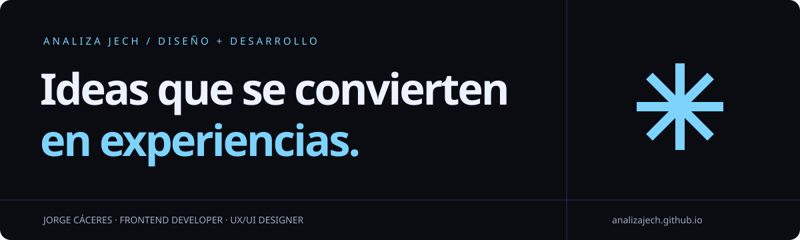
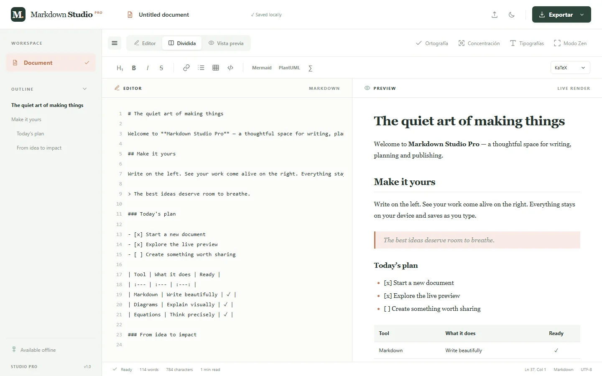
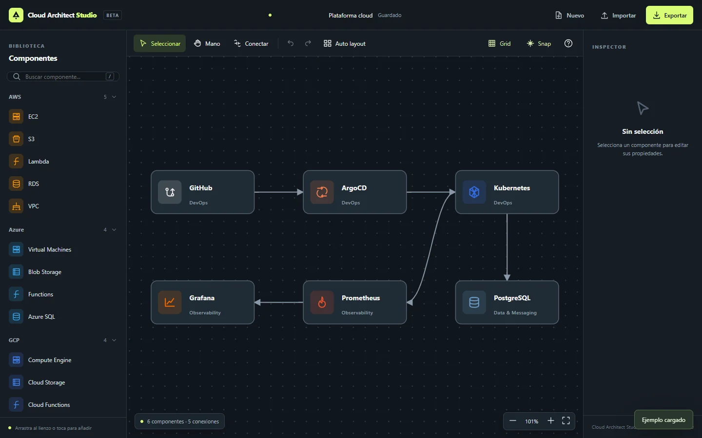
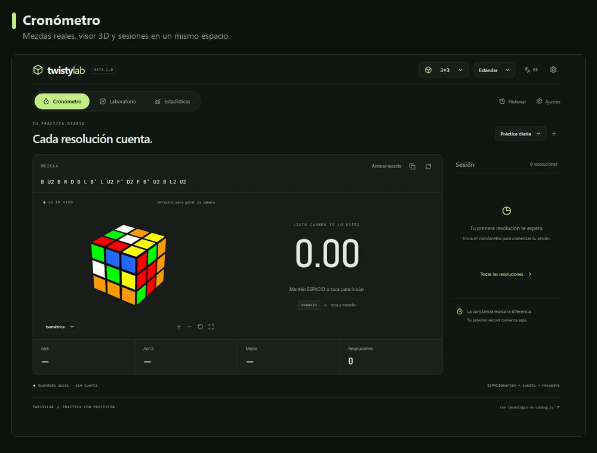

# Jorge Enrique Cáceres Hernández

**Desarrollo frontend · Diseño UX/UI**

Construyo interfaces claras, herramientas útiles y experiencias digitales con personalidad.

## Sobre mí

Soy Jorge, también conocido como **Analiza Jech**. Combino desarrollo frontend y diseño UX/UI: investigo el problema, diseño flujos y prototipos, y construyo interfaces responsive. He trabajado en aplicaciones móviles, experiencias educativas y sistemas web internos. En mis proyectos personales exploro editores, arquitectura cloud e interacción 3D; también comparto tutoriales de tecnología.

## Proyectos destacados

### 01 · Markdown Studio Pro

Editor para escribir, visualizar y exportar Markdown con diagramas y ecuaciones, guardado local y modos de concentración.

  

 

### 02 · Cloud Architect Studio

Lienzo visual para conectar componentes cloud, personalizar nodos y exportar diagramas. Incluye persistencia local y uso sin conexión.

  

 

### 03 · TwistyLab

Laboratorio de speedcubing con cronómetro, puzzles 3D, resolución virtual, estadísticas y sesiones guardadas en el navegador.

  

 

## Herramientas y prácticas

**Frontend**

      

**Diseño UX/UI**

  

Flujos de usuario, wireframes, prototipos de alta fidelidad y componentes reutilizables.

**Backend y colaboración**

    

Scrum, Kanban y documentación de decisiones de diseño.

## Más proyectos

| Proyecto | Enfoque | Código |
| --- | --- | --- |
| Banco Crecer | Web bancaria adaptable | [Repositorio](https://github.com/AnalizaJech/Banco-Crecer) |
| TechScan | Diagnóstico de hardware | [Repositorio](https://github.com/AnalizaJech/Tech-Scan) |
| InnovaSoft | Plataforma educativa | [Repositorio](https://github.com/AnalizaJech/InnovaSoft) |
| JechCommerce | Comercio digital | [Repositorio frontend](https://github.com/AnalizaJech/JechCommerce-front) |
| Librería | Gestión de contenido | [Repositorio](https://github.com/AnalizaJech/Libreria) |

## Conectemos

¿Tienes un proyecto web, una idea de diseño UX/UI o una colaboración en mente?

    

Interfaces con claridad. Experiencias con personalidad.

